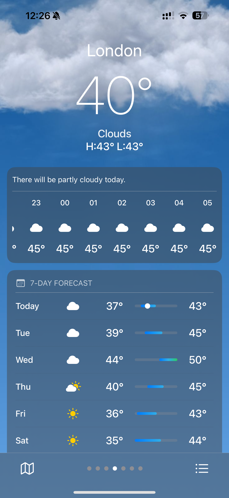
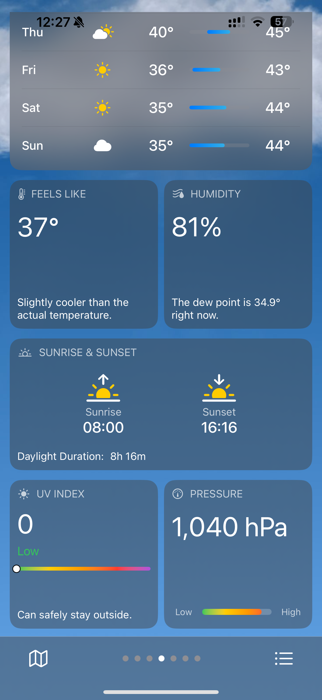
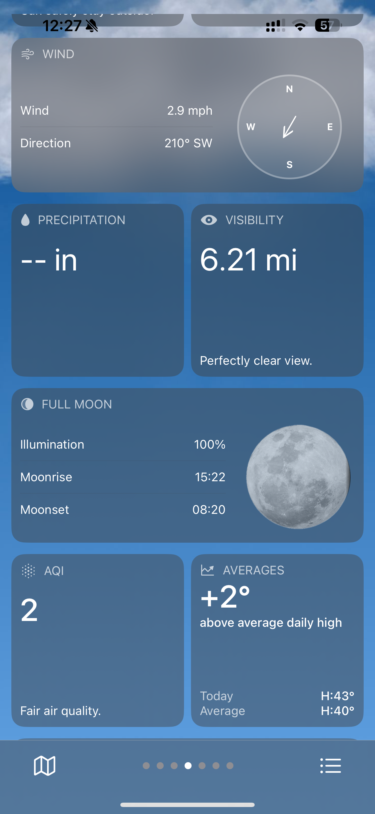
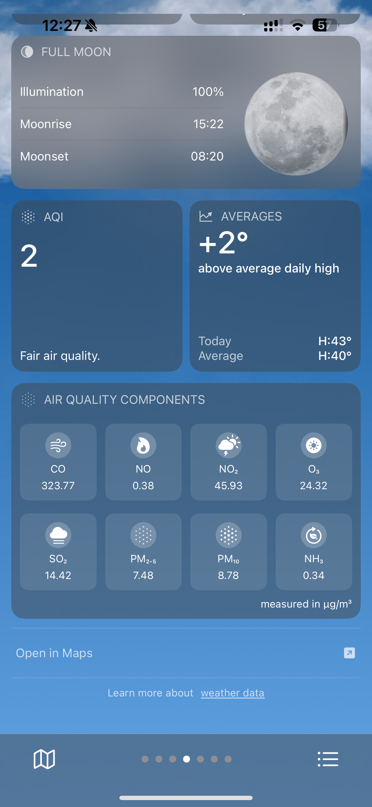
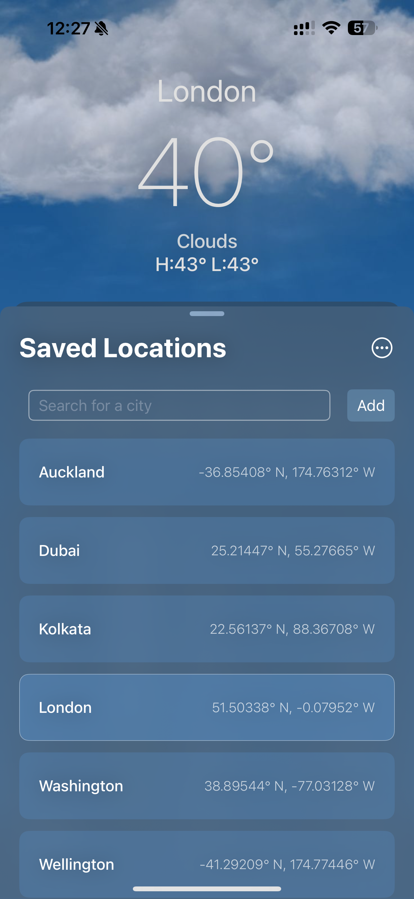
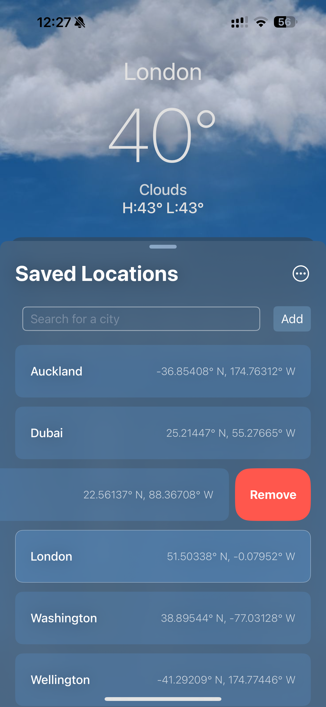
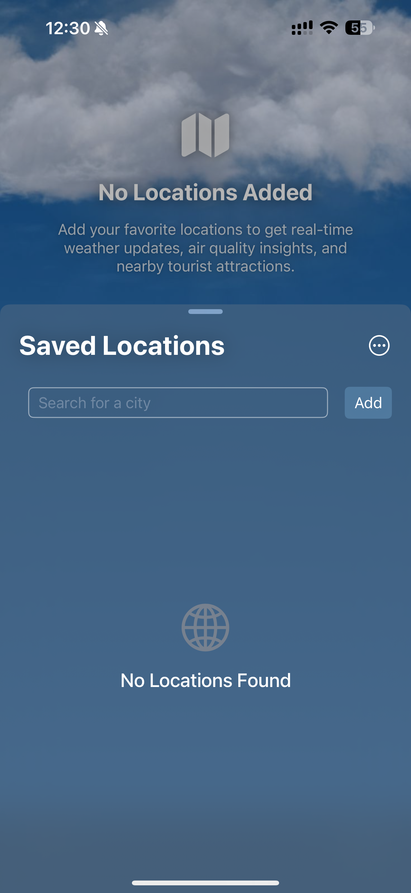
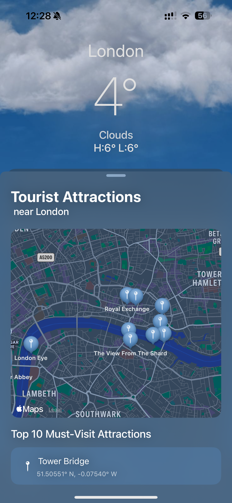
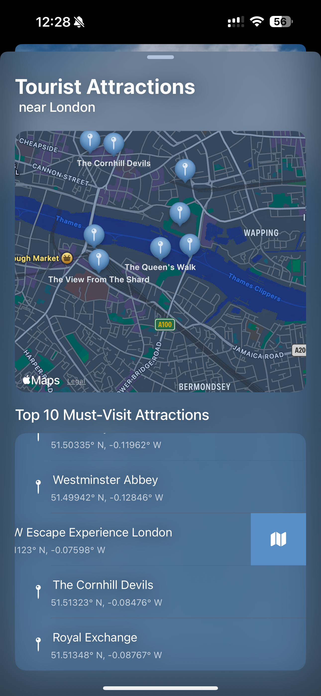

# 🌧️ Pluvia - Weather for the Explorer within You

Pluvia is a beautifully designed weather app that provides accurate, real-time weather and air quality updates with a sleek and modern interface. Features include hourly and weekly forecasts, air quality (and other weather information), saved locations, and a unique Tourist Attractions section with interactive maps for planning trips with precise weather insights. Built with SwiftUI for an elegant and seamless experience. 

---

## 🚀 Features

- **Real-time Weather Updates**  
  Get the latest weather data for your location or search for weather conditions in any city worldwide.

- **Interactive Fluidity**  
  Flow through the app with dynamic, smooth UI effects.

- **Places to Visit**  
  Find nearby tourist attractions to visit and enjoy.

- **iOS-inspired Design**  
  Experience a clean and minimalistic interface inspired by iOS's modern design principles.
---

## 📸 Screenshots

### Home Screen
View the current weather conditions at a glance.  
<div style="display: flex; gap: 10px;">
    
    
    
    
</div>

---

### Saved Locations
Easily manage your favourite locations for quick weather updates.  
<div style="display: flex; gap: 10px;">
    
    
    
</div>

---

### Tourist Attractions
Plan trips better by checking the weather at nearby tourist destinations.  
<div style="display: flex; gap: 10px;">
    
    
</div>

## 🛠️ Technologies Used

- **SwiftUI**: For building the user interface.
- **CoreLocation**: For fetching location related data.
- **OpenWeather API**: For retrieving real-time weather data.
- **MapKit**: For interactive maps (if applicable).
- **SwipeActions**: For handling and customizing swipe actions. [aheze/SwipeActions](https://github.com/aheze/SwipeActions)

---

## 🌐 API Integration

Pluvia uses a weather API for real-time data. Follow these steps to set up your API key:
1. Sign up for a free API key at [OpenWeatherMap](https://openweathermap.org/) or your chosen provider.
2. Add your API key to a `Secrets.plist` file at /Pluvia directory:
   `OPENWEATHER_API_KEY = "YOUR_API_KEY_HERE"`

---

## 📂 Folder Structure
```
Pluvia/
├── Models/                     # Data models for the app
├── Utilities/                  # Utility classes and extensions
├── ViewModels/                 # ViewModels for SwiftUI Views
├── Views/                      # SwiftUI Views
│   ├── MainViews/              # Main sections of the app
│   ├── SharedViews/            # Reusable components
│   ├── WeatherViews/           # Weather-specific views
│       └── WeatherComponents/  # Modular weather components
├── Assets/                     # Asset files (e.g., images, icons)
```
